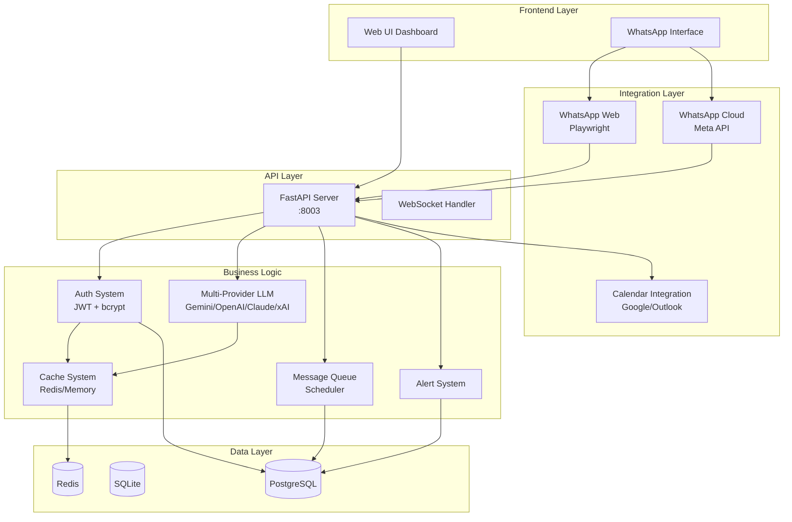
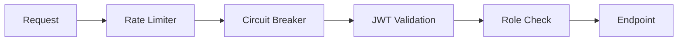
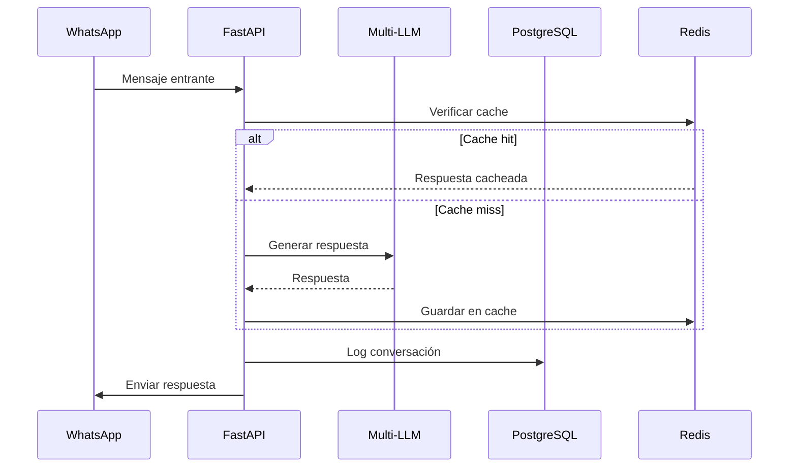

# 🏗️ Arquitectura del Sistema

Este documento describe la arquitectura actual del **Enterprise WhatsApp AI Chatbot Platform**.

## ✅ Estado Actual (Feb 2026)

- **App canónica HTTP**: `admin_panel:app`
- **Routers modulares activos**: `src/routers/*` (auth, business_config, campaigns, monitoring, webhooks, analysis_adaptive, chat_core, analytics, ai_models_admin, calendar_admin, contexts_data, contacts, chat_files_admin, models_online, model_switch_admin, manual_messaging_admin, legacy_compat, legacy_admin_data, system_admin, whatsapp_provider, whatsapp_runtime_admin, lmstudio_admin)
- **Worker separado**: `whatsapp_automator.py`
- **Seguridad activa**: middleware global de auth para `/api/*`, verificación de firma webhook, compare_digest para token legacy, CSP/headers de hardening
- **Documentación operativa**: API en `docs/API.md`, runbook en `docs/SECURITY_RUNBOOK.md`, ADR inicial en `docs/adr/0001-security-hardening.md`
- **Rate limiting HTTP**: middleware global con buckets por endpoint (`/api/*`, `/api/auth/login`, `/api/system/*`), backend Redis con fallback en memoria
- **Rotación Fernet**: verificación periódica de antigüedad de clave en scheduler (`FERNET_KEY_ROTATION_DAYS`)

## 📊 Diagrama de Alto Nivel



## 📁 Estructura de Directorios

```
chatbot-whatsapp-llm/
├── 📁 src/                     # Código fuente principal
│   ├── 📁 models/              # Modelos SQLAlchemy
│   ├── 📁 routers/             # Routers FastAPI modulares (fuente de verdad)
│   │   ├── auth.py             # Autenticación
│   │   ├── monitoring.py       # Monitoreo y métricas
│   │   ├── campaigns.py        # Campañas y cola
│   │   ├── business_config.py  # Configuración de negocio
│   │   ├── ai_models_admin.py  # Configuración avanzada de proveedores IA
│   │   ├── calendar_admin.py   # Configuración e integración calendario
│   │   ├── chat_files_admin.py # Gestión de archivos/chat contextos
│   │   ├── model_switch_admin.py # Cambio de modelos activos (reasoner/current)
│   │   ├── manual_messaging_admin.py # Composición/envío manual, bulk y uploads
│   │   ├── legacy_compat.py   # Endpoints legacy de compatibilidad
│   │   ├── legacy_admin_data.py # Endpoints legacy (/models, /rules, /contacts)
│   │   ├── system_admin.py     # Control de procesos/sistema
│   │   ├── whatsapp_runtime_admin.py # Control runtime de WhatsApp (start/stop/status)
│   │   ├── lmstudio_admin.py   # Gestión LM Studio (modelos/arranque/carga)
│   │   ├── webhooks.py         # Webhooks WhatsApp
│   │   └── deps.py             # Dependencias compartidas
│   └── 📁 services/            # 30+ servicios de negocio
│       ├── auth_system.py      # Autenticación JWT + bcrypt
│       ├── multi_provider_llm.py # Multi-proveedor LLM
│       ├── queue_system.py     # Cola de mensajes
│       ├── alert_system.py     # Sistema de alertas
│       ├── cache_system.py     # Cache Redis
│       ├── protection_system.py # Rate limiting + Circuit Breaker
│       ├── metrics.py          # Métricas Prometheus
│       └── ...
│
├── 📁 tests/                   # Suite de tests
│   ├── api/                    # Tests API por dominio
│   ├── unit/                   # Tests unitarios por dominio
│   ├── test_auth_system.py
│   ├── test_api_endpoints.py
│   ├── test_crypto.py
│   ├── test_protection_system.py
│   ├── test_cache_system.py
│   └── ...
│
├── 📁 config/                  # Archivos de configuración
├── 📁 data/                    # Datos persistentes
├── 📁 ui/                      # UI web estática
├── 📁 alembic/                 # Migraciones de base de datos
│
├── admin_panel.py              # Entry point canónico (FastAPI)
├── whatsapp_automator.py       # Entry point: Worker WhatsApp
├── crypto.py                   # Encriptación Fernet
├── chat_sessions.py            # Gestión de sesiones de chat
├── reasoner.py                 # Motor de razonamiento LLM
├── docker-compose.yml          # Orquestación Docker
├── Dockerfile                  # Container principal
├── requirements.txt            # Dependencias
└── pytest.ini                  # Configuración tests
```

## 🔧 Componentes Principales

### 1. API Layer (FastAPI)

**Nota:** El tráfico productivo debe entrar por `admin_panel:app`.

| Endpoint Group | Prefijo | Descripción |
|---------------|---------|-------------|
| Auth | `/api/auth` | Login, logout, tokens JWT |
| Business | `/api/business` | Configuración del negocio |
| Queue/Campaigns | `/api/campaigns` | Cola de mensajes y campañas |
| Campaigns | `/api/campaigns` | Campañas masivas |
| Alerts | `/api/alerts` | Sistema de alertas |
| Analytics | `/api/analytics` | Métricas y estadísticas |
| WhatsApp | `/api/whatsapp` | Estado y control de WhatsApp |
| LM Studio | `/api/lmstudio` | Control de modelos locales |

### 2. Multi-Provider LLM

Proveedores soportados con fallback automático:

1. **Google Gemini** - Gratuito (15 RPM)
2. **OpenAI** (GPT-4o-mini)
3. **Anthropic Claude**
4. **xAI Grok**
5. **Ollama** (local)
6. **LM Studio** (local)

### 3. Sistema de Seguridad



- **Rate Limiting**: Sliding window algorithm
- **Circuit Breaker**: Protección contra APIs caídas
- **JWT Authentication**: Tokens con expiración
- **bcrypt**: Hash seguro de passwords
- **Fernet**: Encriptación de tokens OAuth
- **HTTP Rate Limiter**: middleware global con headers `X-RateLimit-*` y respuesta `429`
- **Fernet Key Hardening**: permisos restrictivos POSIX + ACL endurecida en Windows

### 4. Sistema de Cola

Estados de mensajes:
- `pending` → `processing` → `sent`
- `pending` → `processing` → `failed` → `retry`
- `cancelled`

### 5. Sistema de Alertas

Tipos de reglas:
- **keyword**: Palabras clave
- **regex**: Patrones regex
- **sentiment**: Análisis de sentimiento

Severidades: `low`, `medium`, `high`

## 🐳 Deployment (Docker)

```yaml
services:
  app:        # API + Admin Panel (puerto 8003)
  worker-web: # WhatsApp Web automation
  scheduler:  # Background jobs
  postgres:   # Base de datos
  redis:      # Cache
```

## 📡 Flujo de Datos



## 🔐 Variables de Entorno Críticas

| Variable | Requerida | Descripción |
|----------|-----------|-------------|
| `JWT_SECRET` | ✅ | Clave secreta (min 32 chars) |
| `ADMIN_PASSWORD` | ✅ | Password administrador |
| `DATABASE_URL` | ❌ | PostgreSQL (default: SQLite) |
| `REDIS_URL` | ❌ | Cache Redis (default: memoria) |
| `CORS_ORIGINS` | ❌ | Orígenes permitidos |
| `WHATSAPP_APP_SECRET` | ✅ (Cloud) | Necesario para validar `X-Hub-Signature-256` |
| `RATE_LIMIT_ENABLED` | ❌ | Habilita rate limiting HTTP global |
| `RATE_LIMIT_REDIS_ENABLED` | ❌ | Usa Redis para contadores de límite |
| `FERNET_KEY_ROTATION_DAYS` | ❌ | Umbral de rotación de clave Fernet |

## 📈 Métricas de Performance

| Métrica | Target |
|---------|--------|
| Response Time | < 1s |
| Concurrent Users | 100+ |
| Uptime | 99.5% |
| Test Coverage | 50%+ |
