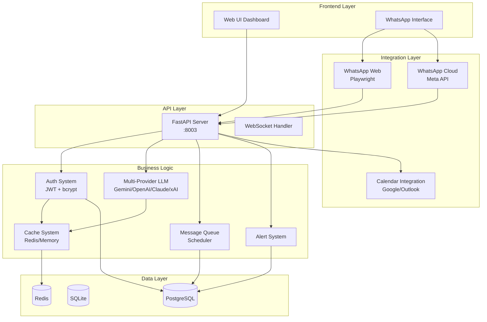
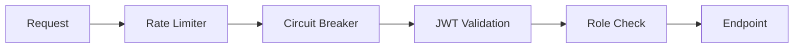
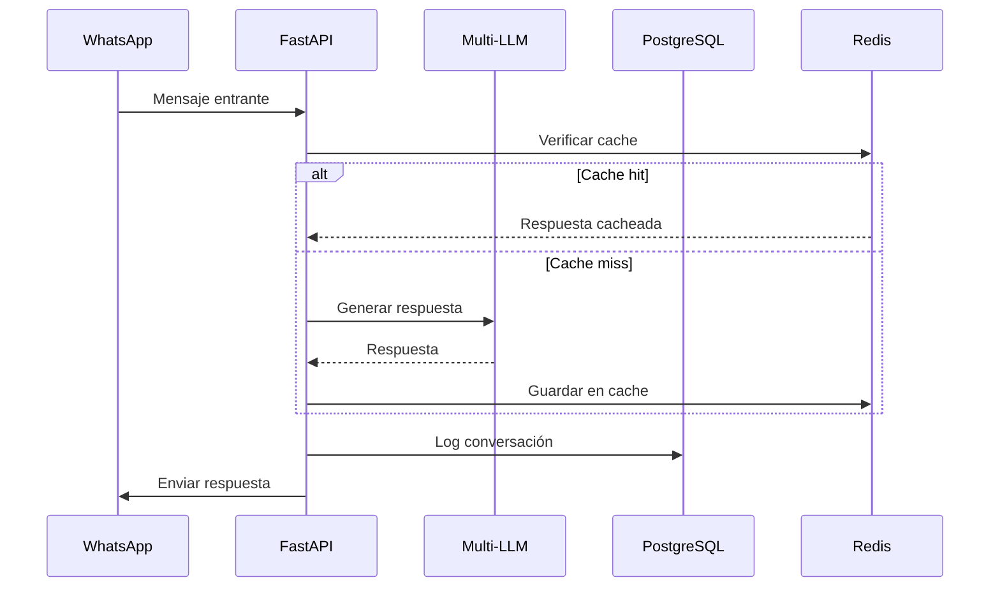

# 🏗️ Arquitectura del Sistema

Este documento describe la arquitectura del **Enterprise WhatsApp AI Chatbot Platform**.

## 📊 Diagrama de Alto Nivel



## 📁 Estructura de Directorios

```
chatbot-whatsapp-llm/
├── 📁 app/                     # Aplicación principal FastAPI
│   ├── 📁 api/                 # Endpoints API REST
│   │   ├── 📁 endpoints/       # Módulos de endpoints
│   │   │   ├── auth.py         # Autenticación
│   │   │   ├── business_config.py
│   │   │   ├── queue.py        # Cola de mensajes
│   │   │   ├── alerts.py       # Sistema de alertas
│   │   │   ├── analytics.py    # Métricas
│   │   │   └── whatsapp.py     # WhatsApp + LLM
│   │   └── router.py           # Router principal
│   ├── 📁 core/                # Módulos centrales
│   │   ├── config.py           # Configuración
│   │   └── utils.py            # Utilidades
│   ├── 📁 db/                  # Conexión a base de datos
│   ├── 📁 models/              # Modelos SQLAlchemy
│   └── 📁 services/            # Servicios de negocio
│
├── 📁 src/                     # Servicios legacy
│   ├── 📁 models/              # Modelos de datos
│   ├── 📁 services/            # 29 servicios
│   │   ├── auth_system.py      # Autenticación JWT
│   │   ├── multi_provider_llm.py
│   │   ├── queue_system.py     # Cola de mensajes
│   │   ├── alert_system.py     # Alertas
│   │   ├── cache_system.py     # Cache Redis
│   │   ├── protection_system.py # Rate limiting
│   │   └── ...
│   └── 📁 workers/             # Workers en background
│
├── 📁 tests/                   # Suite de tests
│   ├── test_auth_system.py
│   ├── test_api_endpoints.py
│   ├── test_security.py
│   ├── test_core_modules.py
│   └── ...
│
├── 📁 config/                  # Archivos de configuración
├── 📁 data/                    # Datos persistentes
├── 📁 ui/                      # UI web estática
├── 📁 logs/                    # Logs del sistema
│
├── admin_panel.py              # API principal (legacy)
├── main_server.py              # Servidor alternativo
├── crypto.py                   # Encriptación Fernet
├── docker-compose.yml          # Orquestación Docker
├── Dockerfile                  # Container principal
├── requirements.txt            # Dependencias
└── pytest.ini                  # Configuración tests
```

## 🔧 Componentes Principales

### 1. API Layer (FastAPI)

| Endpoint Group | Prefijo | Descripción |
|---------------|---------|-------------|
| Auth | `/api/auth` | Login, logout, tokens JWT |
| Business | `/api/business` | Configuración del negocio |
| Queue | `/api/queue` | Cola de mensajes |
| Campaigns | `/api/campaigns` | Campañas masivas |
| Alerts | `/api/alerts` | Sistema de alertas |
| Analytics | `/api/analytics` | Métricas y estadísticas |
| WhatsApp | `/api/whatsapp` | Estado y control de WhatsApp |
| LM Studio | `/api/lmstudio` | Control de modelos locales |

### 2. Multi-Provider LLM

Proveedores soportados con fallback automático:

1. **Google Gemini** - Gratuito (15 RPM)
2. **OpenAI** (GPT-4o-mini)
3. **Anthropic Claude**
4. **xAI Grok**
5. **Ollama** (local)
6. **LM Studio** (local)

### 3. Sistema de Seguridad



- **Rate Limiting**: Sliding window algorithm
- **Circuit Breaker**: Protección contra APIs caídas
- **JWT Authentication**: Tokens con expiración
- **bcrypt**: Hash seguro de passwords
- **Fernet**: Encriptación de tokens OAuth

### 4. Sistema de Cola

Estados de mensajes:
- `pending` → `processing` → `sent`
- `pending` → `processing` → `failed` → `retry`
- `cancelled`

### 5. Sistema de Alertas

Tipos de reglas:
- **keyword**: Palabras clave
- **regex**: Patrones regex
- **sentiment**: Análisis de sentimiento

Severidades: `low`, `medium`, `high`

## 🐳 Deployment (Docker)

```yaml
services:
  app:        # API + Admin Panel (puerto 8003)
  worker-web: # WhatsApp Web automation
  scheduler:  # Background jobs
  postgres:   # Base de datos
  redis:      # Cache
```

## 📡 Flujo de Datos



## 🔐 Variables de Entorno Críticas

| Variable | Requerida | Descripción |
|----------|-----------|-------------|
| `JWT_SECRET` | ✅ | Clave secreta (min 32 chars) |
| `ADMIN_PASSWORD` | ✅ | Password administrador |
| `DATABASE_URL` | ❌ | PostgreSQL (default: SQLite) |
| `REDIS_URL` | ❌ | Cache Redis (default: memoria) |
| `CORS_ORIGINS` | ❌ | Orígenes permitidos |

## 📈 Métricas de Performance

| Métrica | Target |
|---------|--------|
| Response Time | < 1s |
| Concurrent Users | 100+ |
| Uptime | 99.5% |
| Test Coverage | 50%+ |
