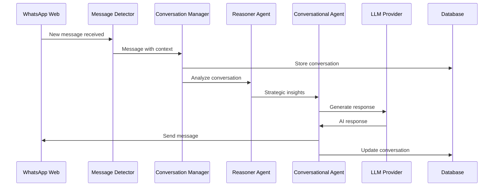
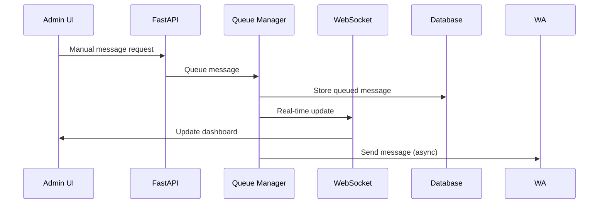

# 🏗️ System Architecture Documentation

## Overview

This document provides a comprehensive technical overview of the WhatsApp LLM Chatbot platform architecture, design patterns, and implementation details.

## Architecture Principles

### 1. **Modular Microservices Design**
- **Separation of Concerns**: Each component has a single responsibility
- **Loose Coupling**: Components communicate through well-defined interfaces
- **High Cohesion**: Related functionality is grouped together
- **Independent Deployability**: Services can be updated without affecting others

### 2. **Event-Driven Architecture**
- **Asynchronous Processing**: Non-blocking operations for scalability
- **Message Queues**: Decoupling of producers and consumers
- **Event Sourcing**: Complete audit trail of system events
- **Reactive Patterns**: Responsive to real-time events

### 3. **Twelve-Factor App Methodology**
- **Configuration Management**: Environment-based configuration
- **Dependency Isolation**: Explicit dependency declarations
- **Process Disposability**: Stateless processes that can be killed/restarted
- **Dev/Prod Parity**: Consistent environments across development stages

## Core Components Deep Dive

### Message Detection Engine

**Technology**: Playwright + Chromium + Custom DOM Analysis

**Key Features**:
- **Intelligent Element Detection**: XPath + CSS selector strategies with fallbacks
- **Real-time Monitoring**: MutationObserver-based DOM change detection
- **Anti-detection Measures**: Randomized delays and human-like behavior simulation
- **Error Recovery**: Automatic retry mechanisms with exponential backoff

**Implementation Details**:
```python
class MessageDetector:
    def __init__(self, browser_context):
        self.browser = browser_context
        self.selectors = self._load_selectors()

    async def detect_new_messages(self) -> List[Message]:
        """Detect new messages using multiple strategies"""
        strategies = [
            self._strategy_xpath,
            self._strategy_css,
            self._strategy_dom_traversal
        ]

        for strategy in strategies:
            try:
                messages = await strategy()
                if messages:
                    return messages
            except Exception as e:
                logger.warning(f"Strategy failed: {e}")
                continue

        return []
```

### Conversation Manager

**Technology**: SQLAlchemy ORM + SQLite + Custom Session Management

**Key Features**:
- **Context Preservation**: Complete conversation history with metadata
- **Session Management**: Automatic cleanup and persistence
- **Contact Classification**: Dynamic allowlist management
- **Performance Optimization**: Lazy loading and query optimization

**Database Schema**:
```sql
-- Conversations table
CREATE TABLE conversations (
    id INTEGER PRIMARY KEY,
    chat_id TEXT NOT NULL,
    timestamp DATETIME NOT NULL,
    context TEXT NOT NULL,
    metadata JSON,
    created_at TIMESTAMP DEFAULT CURRENT_TIMESTAMP
);

-- Sessions table
CREATE TABLE sessions (
    id INTEGER PRIMARY KEY,
    chat_id TEXT UNIQUE NOT NULL,
    last_activity TIMESTAMP,
    context_summary TEXT,
    preferences JSON
);
```

### LLM Integration Layer

**Technology**: Multi-provider abstraction with fallback strategies

**Supported Providers**:
- **OpenAI**: GPT-3.5, GPT-4, GPT-4-turbo
- **Anthropic**: Claude-2, Claude-instant
- **Google**: Gemini Pro, Gemini Ultra
- **xAI**: Grok models
- **Local**: LM Studio, Ollama, GPT4All

**Implementation Pattern**:
```python
class LLMProvider(ABC):
    @abstractmethod
    async def generate_response(self, prompt: str, **kwargs) -> str:
        pass

    @abstractmethod
    def get_token_count(self, text: str) -> int:
        pass

class FallbackChain:
    def __init__(self, providers: List[LLMProvider]):
        self.providers = providers

    async def generate_with_fallback(self, prompt: str) -> str:
        for provider in self.providers:
            try:
                return await provider.generate_response(prompt)
            except Exception as e:
                logger.warning(f"Provider failed: {e}")
                continue
        raise Exception("All providers failed")
```

## Data Flow Architecture

### Message Processing Pipeline


```mermaid
sequenceDiagram
    participant WA as WhatsApp Web
    participant MD as Message Detector
    participant CM as Conversation Manager
    participant RA as Reasoner Agent
    participant CA as Conversational Agent
    participant LM as LLM Provider
    participant DB as Database

    WA->>MD: New message received
    MD->>CM: Message with context
    CM->>DB: Store conversation
    CM->>RA: Analyze conversation
    RA->>CA: Strategic insights
    CA->>LM: Generate response
    LM->>CA: AI response
    CA->>WA: Send message
    CA->>DB: Update conversation
```

### Admin Dashboard Flow


```mermaid
sequenceDiagram
    participant UI as Admin UI
    participant API as FastAPI
    participant QM as Queue Manager
    participant WS as WebSocket
    participant DB as Database

    UI->>API: Manual message request
    API->>QM: Queue message
    QM->>DB: Store queued message
    QM->>WS: Real-time update
    WS->>UI: Update dashboard
    QM->>WA: Send message (async)
```

## Security Architecture

### Authentication & Authorization

**API Security**:
- **Bearer Token Authentication**: JWT-based admin access
- **Role-based Access Control**: Granular permissions system
- **Request Validation**: Pydantic models for input sanitization
- **Rate Limiting**: Configurable request throttling

**Data Security**:
- **Encryption at Rest**: Fernet AES-256 for sensitive data
- **Secure Communication**: HTTPS for all external communications
- **Input Sanitization**: XSS and injection prevention
- **Audit Logging**: Complete operation tracking

### Implementation Example

```python
from fastapi import Depends, HTTPException
from fastapi.security import HTTPBearer, HTTPAuthorizationCredentials
import jwt
from cryptography.fernet import Fernet

security = HTTPBearer()

def verify_token(credentials: HTTPAuthorizationCredentials = Depends(security)):
    try:
        payload = jwt.decode(credentials.credentials, SECRET_KEY, algorithms=["HS256"])
        return payload
    except jwt.ExpiredSignatureError:
        raise HTTPException(status_code=401, detail="Token expired")
    except jwt.InvalidTokenError:
        raise HTTPException(status_code=401, detail="Invalid token")

@app.post("/api/admin/messages")
async def send_message(
    request: MessageRequest,
    user: dict = Depends(verify_token)
):
    # Only authenticated admin users can send messages
    if user.get("role") != "admin":
        raise HTTPException(status_code=403, detail="Insufficient permissions")

    # Encrypt sensitive data
    cipher = Fernet(settings.fernet_key)
    encrypted_content = cipher.encrypt(request.content.encode())

    # Process message...
```

## Performance Optimization

### Database Optimization

**Indexing Strategy**:
```sql
-- Performance indexes
CREATE INDEX idx_conversations_chat_id ON conversations(chat_id);
CREATE INDEX idx_conversations_timestamp ON conversations(timestamp);
CREATE INDEX idx_sessions_last_activity ON sessions(last_activity);
```

**Query Optimization**:
- **Connection Pooling**: SQLAlchemy connection pool management
- **Lazy Loading**: Selective loading of related data
- **Batch Operations**: Bulk inserts/updates for efficiency
- **Query Caching**: Redis-backed query result caching

### Memory Management

**Resource Optimization**:
- **Object Pooling**: Reusable browser contexts
- **Garbage Collection**: Explicit cleanup of large objects
- **Memory Profiling**: Built-in memory usage monitoring
- **Cache Management**: TTL-based cache expiration

### Concurrent Processing

**Async Patterns**:
```python
import asyncio
from concurrent.futures import ThreadPoolExecutor

class AsyncProcessor:
    def __init__(self):
        self.executor = ThreadPoolExecutor(max_workers=4)

    async def process_message(self, message: Message) -> Response:
        # CPU-intensive tasks in thread pool
        loop = asyncio.get_event_loop()
        result = await loop.run_in_executor(
            self.executor,
            self._cpu_intensive_processing,
            message
        )

        # I/O operations remain async
        response = await self._generate_response(result)
        return response
```

## Monitoring & Observability

### Health Checks

**System Health Endpoints**:
```python
@app.get("/healthz")
async def health_check():
    """Comprehensive system health check"""
    health_status = {
        "database": await check_database_health(),
        "llm_providers": await check_llm_health(),
        "whatsapp_connection": await check_whatsapp_health(),
        "memory_usage": get_memory_usage(),
        "disk_space": get_disk_space(),
        "uptime": get_system_uptime()
    }

    overall_status = "healthy" if all(
        status == "ok" for status in health_status.values()
    ) else "degraded"

    return {
        "status": overall_status,
        "timestamp": datetime.utcnow(),
        "checks": health_status
    }
```

### Logging Architecture

**Structured Logging**:
```python
import logging
import json
from pythonjsonlogger import jsonlogger

class CustomFormatter(jsonlogger.JsonFormatter):
    def add_fields(self, log_record, record, message_dict):
        super().add_fields(log_record, record, message_dict)
        log_record['service'] = 'whatsapp-llm-chatbot'
        log_record['version'] = '1.0.0'
        log_record['environment'] = os.getenv('ENVIRONMENT', 'development')

# Configure logging
logger = logging.getLogger(__name__)
handler = logging.StreamHandler()
handler.setFormatter(CustomFormatter())
logger.addHandler(handler)
logger.setLevel(logging.INFO)
```

### Metrics Collection

**Performance Metrics**:
- **Response Times**: P95, P99 latency tracking
- **Error Rates**: Per-endpoint error monitoring
- **Resource Usage**: CPU, memory, disk utilization
- **Business Metrics**: Messages processed, conversations managed

## Deployment Architecture

### Containerization Strategy

**Docker Configuration**:
```dockerfile
FROM python:3.11-slim

# Security hardening
RUN apt-get update && apt-get install -y \
    curl \
    && rm -rf /var/lib/apt/lists/*

# Create non-root user
RUN useradd --create-home --shell /bin/bash app
USER app

# Application setup
WORKDIR /app
COPY requirements.txt .
RUN pip install --no-cache-dir -r requirements.txt

COPY . .
EXPOSE 8014

HEALTHCHECK --interval=30s --timeout=10s --start-period=5s --retries=3 \
    CMD curl -f http://localhost:8014/healthz || exit 1

CMD ["python", "clean_start.py"]
```

### Orchestration with Docker Compose

**Production Configuration**:
```yaml
version: '3.8'
services:
  app:
    build: .
    environment:
      - DATABASE_URL=postgresql://user:pass@db:5432/chatbot
      - REDIS_URL=redis://cache:6379
      - ENVIRONMENT=production
    ports:
      - "8014:8014"
    volumes:
      - ./data:/app/data
      - ./logs:/app/logs
    depends_on:
      - db
      - cache
    restart: unless-stopped

  db:
    image: postgres:15
    environment:
      - POSTGRES_DB=chatbot
      - POSTGRES_USER=user
      - POSTGRES_PASSWORD=pass
    volumes:
      - postgres_data:/var/lib/postgresql/data
    restart: unless-stopped

  cache:
    image: redis:7-alpine
    volumes:
      - redis_data:/data
    restart: unless-stopped

volumes:
  postgres_data:
  redis_data:
```

## Error Handling & Resilience

### Circuit Breaker Pattern

```python
class CircuitBreaker:
    def __init__(self, failure_threshold=5, recovery_timeout=60):
        self.failure_threshold = failure_threshold
        self.recovery_timeout = recovery_timeout
        self.failure_count = 0
        self.last_failure_time = None
        self.state = 'closed'

    async def call(self, func, *args, **kwargs):
        if self.state == 'open':
            if self._should_attempt_reset():
                self.state = 'half-open'
            else:
                raise CircuitBreakerError("Circuit is open")

        try:
            result = await func(*args, **kwargs)
            self._on_success()
            return result
        except Exception as e:
            self._on_failure()
            raise e

    def _should_attempt_reset(self):
        return (time.time() - self.last_failure_time) > self.recovery_timeout
```

### Graceful Degradation

**Fallback Strategies**:
- **LLM Provider Fallback**: Automatic switching between providers
- **Cache Fallback**: Serve stale data when backend is unavailable
- **Feature Flags**: Disable non-critical features under load
- **Queue Backpressure**: Prevent system overload with request queuing

## Conclusion

This architecture demonstrates enterprise-grade software design principles with a focus on scalability, reliability, and maintainability. The modular design allows for independent evolution of components while maintaining system coherence through well-defined interfaces and communication patterns.

The implementation showcases advanced concepts such as:
- **Domain-driven design** with clear bounded contexts
- **Event-driven architecture** for loose coupling
- **Resilient design patterns** for fault tolerance
- **Performance optimization** techniques for high throughput
- **Observability patterns** for system monitoring

This foundation provides a solid base for future enhancements and scaling requirements.