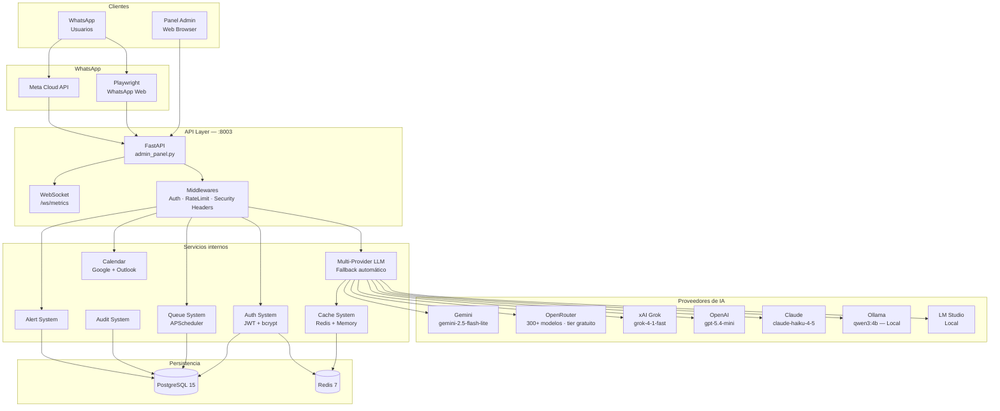
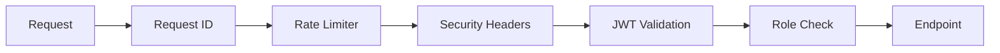
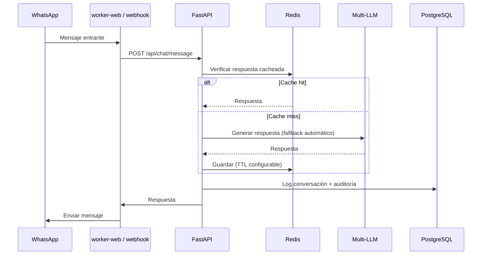

# Arquitectura del Sistema

**Última actualización:** Abril 2026

---

## Estado actual

- **App canónica HTTP**: `admin_panel:app` (FastAPI, puerto 8003)
- **Routers modulares**: `src/routers/` — 22 routers cargados al startup
- **Worker separado**: `whatsapp_automator.py` (Playwright, contenedor `worker-web`)
- **Scheduler**: `src/workers/scheduler_worker.py` (contenedor `scheduler`)
- **Docs API**: deshabilitados por defecto en producción (`DISABLE_DOCS=true`). Activar con `DISABLE_DOCS=false` para desarrollo.

---

## Diagrama de alto nivel


```mermaid
graph TB
    subgraph "Clientes"
        WA[WhatsApp\nUsuarios]
        ADMIN[Panel Admin\nWeb Browser]
    end

    subgraph "API Layer — :8003"
        FW[FastAPI\nadmin_panel.py]
        WS[WebSocket\n/ws/metrics]
        MW[Middlewares\nAuth · RateLimit · Security Headers]
    end

    subgraph "Proveedores de IA"
        GEM[Gemini\ngemini-2.5-flash-lite]
        OR[OpenRouter\n300+ modelos · tier gratuito]
        XAI[xAI Grok\ngrok-4-1-fast]
        OAI[OpenAI\ngpt-5.4-mini]
        CLA[Claude\nclaude-haiku-4-5]
        OLL[Ollama\nqwen3:4b — Local]
        LMS[LM Studio\nLocal]
    end

    subgraph "WhatsApp"
        WEB[Playwright\nWhatsApp Web]
        CLOUD[Meta Cloud API]
    end

    subgraph "Servicios internos"
        AUTH[Auth System\nJWT + bcrypt]
        LLM[Multi-Provider LLM\nFallback automático]
        QUEUE[Queue System\nAPScheduler]
        CACHE[Cache System\nRedis + Memory]
        AUDIT[Audit System]
        ALERT[Alert System]
        CAL[Calendar\nGoogle + Outlook]
    end

    subgraph "Persistencia"
        PG[(PostgreSQL 15)]
        REDIS[(Redis 7)]
    end

    WA --> WEB & CLOUD
    ADMIN --> FW
    WEB & CLOUD --> FW
    FW --> MW --> AUTH & LLM & QUEUE & ALERT & CAL
    FW --> WS

    LLM --> GEM & OR & XAI & OAI & CLA & OLL & LMS
    AUTH & QUEUE & AUDIT & ALERT --> PG
    CACHE & AUTH --> REDIS
    LLM --> CACHE
```

---

## Estructura de directorios

```
chatbot-whatsapp-llm/
├── admin_panel.py              # Entry point FastAPI (canónico)
├── whatsapp_automator.py       # Worker WhatsApp Web (Playwright)
├── crypto.py                   # Encriptación Fernet
├── chat_sessions.py            # Gestión de sesiones de chat
│
├── src/
│   ├── models/                 # Modelos SQLAlchemy
│   │   └── admin_db.py         # Engine, sesión, inicialización
│   ├── routers/                # 22 routers FastAPI modulares
│   │   ├── auth.py             # Login, logout, refresh, JWT WS token
│   │   ├── chat_core.py        # Chat principal, prompts, settings
│   │   ├── contacts.py         # Gestión de contactos
│   │   ├── campaigns.py        # Campañas y mensajería masiva
│   │   ├── manual_messaging_admin.py  # Envío manual
│   │   ├── business_config.py  # Configuración del negocio
│   │   ├── ai_models_admin.py  # Admin de proveedores IA
│   │   ├── calendar_admin.py   # Calendario (Google/Outlook)
│   │   ├── analytics.py        # Métricas y dashboards
│   │   ├── monitoring.py       # Health, estado del sistema
│   │   ├── webhooks.py         # Webhooks WhatsApp Cloud
│   │   ├── whatsapp_provider.py          # Control WhatsApp
│   │   ├── whatsapp_runtime_admin.py     # Start/stop runtime
│   │   ├── system_admin.py     # Control de procesos
│   │   ├── model_switch_admin.py         # Cambio de modelos activos
│   │   ├── models_online.py    # Modelos cloud disponibles
│   │   ├── lmstudio_admin.py   # Control LM Studio local
│   │   ├── contexts_data.py    # Contextos y archivos de chat
│   │   ├── chat_files_admin.py # Gestión de archivos
│   │   ├── analysis_adaptive.py          # Análisis adaptativo
│   │   ├── legacy_compat.py    # Endpoints legacy
│   │   ├── legacy_admin_data.py          # Datos legacy
│   │   └── deps.py             # Dependencias compartidas
│   │
│   └── services/               # 30+ servicios de negocio
│       ├── auth_system.py      # JWT, bcrypt, tokens
│       ├── multi_provider_llm.py         # LLM multi-proveedor + fallback
│       ├── cache_system.py     # Redis con fallback en memoria
│       ├── queue_system.py     # Cola de mensajes
│       ├── alert_system.py     # Reglas y notificaciones
│       ├── audit_system.py     # Log de eventos de seguridad
│       ├── http_rate_limit.py  # Rate limiting global
│       ├── protection_system.py          # Circuit breaker
│       ├── metrics.py          # Prometheus metrics
│       ├── audio_transcriber.py          # Whisper (faster-whisper)
│       ├── calendar_service.py           # Integración calendarios
│       ├── whatsapp_system.py  # Lógica WhatsApp
│       ├── context_loader.py   # Carga de contextos por chat
│       ├── humanized_responses.py        # Humanización de respuestas
│       └── ...
│
├── alembic/                    # Migraciones de base de datos
│   └── versions/               # 6 migraciones (inicial → actual)
├── tests/                      # Suite de tests (pytest)
├── ui/                         # Frontend estático HTML/CSS/JS
├── templates/                  # Templates Jinja2
├── data/                       # Datos persistentes (no en git)
├── logs/                       # Logs de aplicación (no en git)
├── config/                     # Configuración runtime
│
├── Dockerfile                  # Imagen app (multi-stage)
├── Dockerfile.worker-web       # Imagen worker Playwright
├── Dockerfile.scheduler        # Imagen scheduler
├── docker-compose.yml          # Orquestación (5 servicios)
├── docker-compose.proxy.yml    # Nginx reverse proxy (opcional)
├── docker-compose.backup.yml   # Backup PostgreSQL (opcional)
├── requirements.txt            # Dependencias producción
├── requirements-worker.txt     # Dependencias worker (+ playwright)
└── requirements-dev.txt        # Dependencias desarrollo (+ pytest)
```

---

## Componentes principales

### 1. API Layer (FastAPI)

Todos los endpoints `/api/*` requieren `Authorization: Bearer <jwt>` excepto:
- `POST /api/auth/login`
- `GET /api/auth/refresh`
- OAuth callbacks de calendario

| Grupo | Prefijo | Descripción |
|-------|---------|-------------|
| Auth | `/api/auth` | Login, refresh, me, logout, ws-token |
| Chat | `/api/chat` | Conversación, prompts, settings |
| Contacts | `/api/contacts` | CRM de contactos |
| Campaigns | `/api/campaigns` | Cola y campañas masivas |
| Business | `/api/business` | Config del negocio, contexto |
| AI Models | `/api/ai-models` | Proveedores, test de conexión |
| Calendar | `/api/calendar` | Config y OAuth (Google/Outlook) |
| Analytics | `/api/analytics` | Métricas, dashboards |
| Monitoring | `/api/monitoring` | Health detallado, estado |
| WhatsApp | `/api/whatsapp` | Estado, start/stop runtime |
| System | `/api/system` | Control de procesos (solo admin) |
| Webhooks | `/api/webhook` | Entrada de mensajes WhatsApp Cloud |
| Health | `/healthz` | Health check (sin auth) |
| Metrics | `/metrics` | Prometheus metrics (sin auth) |

### 2. Multi-Provider LLM con fallback

Fallback order configurable en `.env` con `AI_FALLBACK_ORDER`:

```
gemini → openrouter → xai → openai → claude → ollama → lmstudio
```

Modelos activos (Abril 2026):

| Proveedor | Variable | Modelo default |
|-----------|----------|---------------|
| Gemini | `GEMINI_API_KEY` | `gemini-2.5-flash-lite` |
| OpenRouter | `OPENROUTER_API_KEY` | `google/gemini-2.5-flash-lite:free` |
| xAI | `XAI_API_KEY` | `grok-4-1-fast` |
| OpenAI | `OPENAI_API_KEY` | `gpt-5.4-mini` |
| Claude | `CLAUDE_API_KEY` | `claude-haiku-4-5-20251001` |
| Ollama | — (local) | `qwen3:4b` |
| LM Studio | — (local) | `qwen3.5-4b-q4_k_m` |

### 3. Sistema de seguridad


```mermaid
graph LR
    REQ[Request] --> RID[Request ID]
    RID --> RL[Rate Limiter]
    RL --> SH[Security Headers]
    SH --> AUTH[JWT Validation]
    AUTH --> RBAC[Role Check]
    RBAC --> EP[Endpoint]
```

Controles activos:
- **Rate limiting**: sliding window por endpoint, backend Redis con fallback en memoria
- **Circuit breaker**: protección automática ante fallos de APIs externas
- **JWT**: tokens con expiración, refresh tokens, ws-tokens con scope específico
- **bcrypt**: hash de contraseñas
- **Fernet**: encriptación de tokens OAuth y datos sensibles
- **Headers**: CSP, X-Frame-Options, HSTS, CORP, COOP, Referrer-Policy
- **Audit log**: registro estructurado de eventos de seguridad
- **CORS**: validación estricta, nunca permite `*` con credentials

### 4. Sistema de cola

```
pending → processing → sent
pending → processing → failed → retry (hasta N intentos)
cancelled
```

El scheduler ejecuta trabajos periódicos: procesamiento de cola, rotación de keys Fernet, limpieza de sesiones.

### 5. Audio (faster-whisper)

Transcripción local de notas de voz. Requiere `faster-whisper` instalado (incluido en `requirements.txt`) y `ffmpeg` en el sistema (incluido en el Dockerfile).

Configuración:
```env
AUDIO_TRANSCRIPTION_ENABLED=true
WHISPER_MODEL_SIZE=base        # tiny, base, small, medium, large
WHISPER_DEVICE=cpu             # cpu o cuda
```

---

## Flujo de mensaje entrante


```mermaid
sequenceDiagram
    participant WA as WhatsApp
    participant WK as worker-web / webhook
    participant API as FastAPI
    participant CACHE as Redis
    participant LLM as Multi-LLM
    participant DB as PostgreSQL

    WA->>WK: Mensaje entrante
    WK->>API: POST /api/chat/message
    API->>CACHE: Verificar respuesta cacheada
    alt Cache hit
        CACHE-->>API: Respuesta
    else Cache miss
        API->>LLM: Generar respuesta (fallback automático)
        LLM-->>API: Respuesta
        API->>CACHE: Guardar (TTL configurable)
    end
    API->>DB: Log conversación + auditoría
    API->>WK: Respuesta
    WK->>WA: Enviar mensaje
```

---

## Variables de entorno críticas

| Variable | Requerida | Descripción |
|----------|-----------|-------------|
| `JWT_SECRET` | Sí | Clave JWT (mín. 32 chars, generada automáticamente) |
| `ADMIN_PASSWORD` | Sí | Password admin inicial (mín. 8 chars) |
| `OPERATOR_PASSWORD` | No | Password operador inicial |
| `POSTGRES_PASSWORD` | Sí (Docker) | Password PostgreSQL |
| `REDIS_PASSWORD` | Sí (Docker) | Password Redis |
| `REDIS_URL` | No | URL Redis (default: solo memoria) |
| `DATABASE_URL` | No | URL PostgreSQL (default: SQLite) |
| `LEGACY_TOKEN_ENABLED` | No | `false` en producción/beta |
| `DISABLE_DOCS` | No | `true` en producción, `false` en desarrollo |
| `AUTO_MIGRATE` | No | `true` ejecuta migraciones al iniciar |
| `WHATSAPP_MODE` | No | `web`, `cloud`, o `both` |
| `WHATSAPP_APP_SECRET` | Sí (Cloud) | Firma de webhooks Meta |
| `GEMINI_API_KEY` | Mín. 1 IA | API key Google AI Studio |
| `OPENROUTER_API_KEY` | Mín. 1 IA | API key OpenRouter (gratuito) |
| `OPENAI_API_KEY` | No | API key OpenAI |
| `CLAUDE_API_KEY` | No | API key Anthropic |
| `XAI_API_KEY` | No | API key xAI |
| `GEMINI_MODEL` | No | Default: `gemini-2.5-flash-lite` |
| `OPENROUTER_MODEL` | No | Default: `google/gemini-2.5-flash-lite:free` |
| `OPENAI_MODEL` | No | Default: `gpt-5.4-mini` |
| `CLAUDE_MODEL` | No | Default: `claude-haiku-4-5-20251001` |
| `XAI_MODEL` | No | Default: `grok-4-1-fast` |
| `AI_FALLBACK_ORDER` | No | Default: `gemini,openrouter,xai,openai,claude,ollama,lmstudio` |
| `CORS_ORIGINS` | No | Orígenes CORS permitidos |
| `LOG_LEVEL` | No | `INFO` (default), `DEBUG`, `WARNING` |
| `LOG_FORMAT` | No | `plain` (desarrollo), `json` (producción) |

---

## Migraciones de base de datos (Alembic)

6 migraciones en orden:

1. `20260213_01` — Tablas core (usuarios, mensajes, sesiones)
2. `20260215_02` — Tablas de dominio (contactos, campañas)
3. `20260215_03` — Calendario y citas
4. `20260215_04` — Índices compuestos de auditoría
5. `20260215_05` — Escalabilidad y persistencia (fase 3)
6. `20260217_06` — Tablas de analítica

---

## Docker — servicios y recursos

| Servicio | Imagen | Puerto | CPU | RAM |
|----------|--------|--------|-----|-----|
| `app` | `Dockerfile` | 8003 | 1.00 | 1GB |
| `worker-web` | `Dockerfile.worker-web` | — | 1.00 | 1GB |
| `scheduler` | `Dockerfile.scheduler` | — | 0.75 | 512MB |
| `postgres` | `postgres:15-alpine` | 5432 (localhost) | 0.75 | 768MB |
| `redis` | `redis:7-alpine` | 6379 (localhost) | 0.50 | 384MB |
