# 🏗️ Arquitectura del Sistema

Este documento describe la arquitectura del **Enterprise WhatsApp AI Chatbot Platform**.

## 📊 Diagrama de Alto Nivel


## 📁 Estructura de Directorios

```
chatbot-whatsapp-llm/
├── 📁 src/                     # Código fuente principal
│   ├── 📁 models/              # Modelos SQLAlchemy
│   ├── 📁 routers/             # Routers FastAPI modulares
│   │   ├── auth.py             # Autenticación
│   │   ├── monitoring.py       # Monitoreo y métricas
│   │   ├── campaigns.py        # Campañas y cola
│   │   ├── business_config.py  # Configuración de negocio
│   │   ├── webhooks.py         # Webhooks WhatsApp
│   │   └── deps.py             # Dependencias compartidas
│   └── 📁 services/            # 30+ servicios de negocio
│       ├── auth_system.py      # Autenticación JWT + bcrypt
│       ├── multi_provider_llm.py # Multi-proveedor LLM
│       ├── queue_system.py     # Cola de mensajes
│       ├── alert_system.py     # Sistema de alertas
│       ├── cache_system.py     # Cache Redis
│       ├── protection_system.py # Rate limiting + Circuit Breaker
│       ├── metrics.py          # Métricas Prometheus
│       └── ...
│
├── 📁 tests/                   # Suite de tests
│   ├── test_auth_system.py
│   ├── test_api_endpoints.py
│   ├── test_crypto.py
│   ├── test_protection_system.py
│   ├── test_cache_system.py
│   └── ...
│
├── 📁 config/                  # Archivos de configuración
├── 📁 data/                    # Datos persistentes
├── 📁 ui/                      # UI web estática
├── 📁 alembic/                 # Migraciones de base de datos
│
├── admin_panel.py              # Entry point: API de administración
├── main_server.py              # Entry point: Servidor principal
├── whatsapp_automator.py       # Entry point: Worker WhatsApp
├── crypto.py                   # Encriptación Fernet
├── chat_sessions.py            # Gestión de sesiones de chat
├── reasoner.py                 # Motor de razonamiento LLM
├── docker-compose.yml          # Orquestación Docker
├── Dockerfile                  # Container principal
├── requirements.txt            # Dependencias
└── pytest.ini                  # Configuración tests
```

## 🔧 Componentes Principales

### 1. API Layer (FastAPI)

| Endpoint Group | Prefijo | Descripción |
|---------------|---------|-------------|
| Auth | `/api/auth` | Login, logout, tokens JWT |
| Business | `/api/business` | Configuración del negocio |
| Queue | `/api/queue` | Cola de mensajes |
| Campaigns | `/api/campaigns` | Campañas masivas |
| Alerts | `/api/alerts` | Sistema de alertas |
| Analytics | `/api/analytics` | Métricas y estadísticas |
| WhatsApp | `/api/whatsapp` | Estado y control de WhatsApp |
| LM Studio | `/api/lmstudio` | Control de modelos locales |

### 2. Multi-Provider LLM

Proveedores soportados con fallback automático:

1. **Google Gemini** - Gratuito (15 RPM)
2. **OpenAI** (GPT-4o-mini)
3. **Anthropic Claude**
4. **xAI Grok**
5. **Ollama** (local)
6. **LM Studio** (local)

### 3. Sistema de Seguridad


- **Rate Limiting**: Sliding window algorithm
- **Circuit Breaker**: Protección contra APIs caídas
- **JWT Authentication**: Tokens con expiración
- **bcrypt**: Hash seguro de passwords
- **Fernet**: Encriptación de tokens OAuth

### 4. Sistema de Cola

Estados de mensajes:
- `pending` → `processing` → `sent`
- `pending` → `processing` → `failed` → `retry`
- `cancelled`

### 5. Sistema de Alertas

Tipos de reglas:
- **keyword**: Palabras clave
- **regex**: Patrones regex
- **sentiment**: Análisis de sentimiento

Severidades: `low`, `medium`, `high`

## 🐳 Deployment (Docker)

```yaml
services:
  app:        # API + Admin Panel (puerto 8003)
  worker-web: # WhatsApp Web automation
  scheduler:  # Background jobs
  postgres:   # Base de datos
  redis:      # Cache
```

## 📡 Flujo de Datos

```mermaid
sequenceDiagram
    participant WA as WhatsApp
    participant API as FastAPI
    participant LLM as Multi-LLM
    participant DB as PostgreSQL
    participant Cache as Redis
    
    WA->>API: Mensaje entrante
    API->>Cache: Verificar cache
    alt Cache hit
        Cache-->>API: Respuesta cacheada
    else Cache miss
        API->>LLM: Generar respuesta
        LLM-->>API: Respuesta
        API->>Cache: Guardar en cache
    end
    API->>DB: Log conversación
    API->>WA: Enviar respuesta
```



## 🔐 Variables de Entorno Críticas

| Variable | Requerida | Descripción |
|----------|-----------|-------------|
| `JWT_SECRET` | ✅ | Clave secreta (min 32 chars) |
| `ADMIN_PASSWORD` | ✅ | Password administrador |
| `DATABASE_URL` | ❌ | PostgreSQL (default: SQLite) |
| `REDIS_URL` | ❌ | Cache Redis (default: memoria) |
| `CORS_ORIGINS` | ❌ | Orígenes permitidos |

## 📈 Métricas de Performance

| Métrica | Target |
|---------|--------|
| Response Time | < 1s |
| Concurrent Users | 100+ |
| Uptime | 99.5% |
| Test Coverage | 50%+ |
